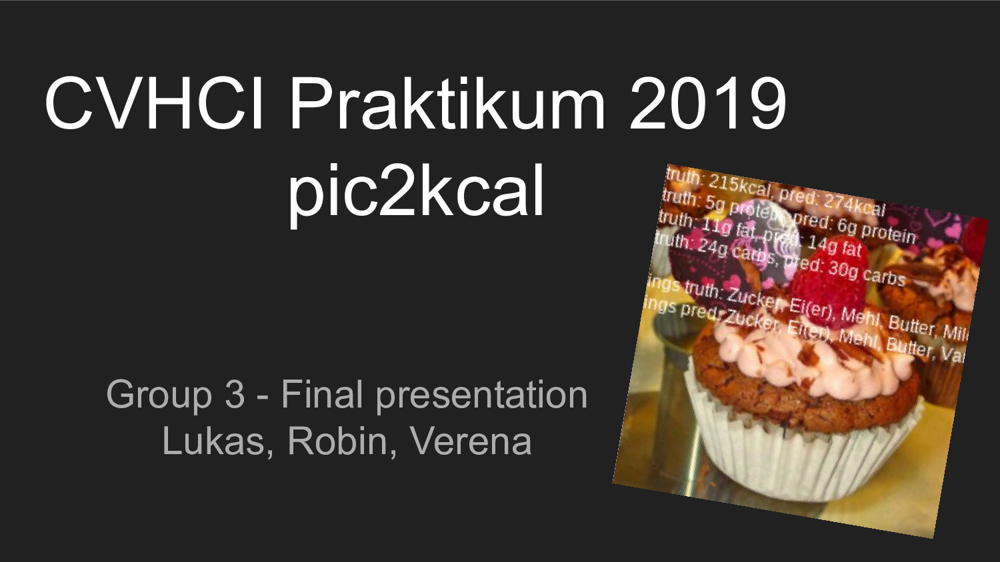

# Slides

## Notes

### Potential recipe sites

* https://chefkoch.de - 320k recipes
* https://lecker.de - 8k recipes
* https://essen-und-trinken.de - ?? recipes, organized kinda weirdly
* https://lecker.de - 60k recipes
* https://www.kuechengoetter.de - ?? recipes, partially with kcal data
* https://eatsmarter.de/rezepte

* international sites?

## portionsgrößen

https://www.lebensmittelwissen.de/tipps/haushalt/portionsgroessen/
https://www.bvl.bund.de/SharedDocs/Downloads/04_Pflanzenschutzmittel/rueckst_gew_obst_gem%C3%BCde_pdf.html?nn=1401078
https://ndb.nal.usda.gov/ndb/
