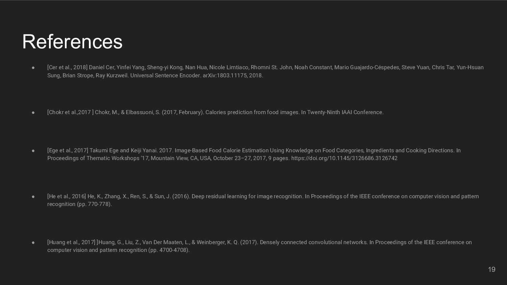

# Result Slides

## Pipeline

1. Scraping
    1. Download fddb.info to html files using wget (sadly much more resource intensive than it should be since fddb.info immediately closes http connections after every call). `wget -4 -nc -r -l inf --adjust-extension --page-requisites --include-directories='/db/de/produktgruppen,/db/de/lebensmittel' https://fddb.info/db/de/produktgruppen/produkt_verzeichnis/index.html --reject jpg,png -o log4 --waitretry=3 -U 'Mozilla/5.0 (Windows NT 10.0; Win64; x64) AppleWebKit/537.36 (KHTML, like Gecko) Chrome/74.0.3729.169 Safari/537.36b`
    2. Run the steps in the [scraping](scraping/) directory one by one.
2. Ingredients Matching

    Run all the notebooks in the [extract_ingredients](extract_ingredients/) directory.
3. Dataset creation

    Run [nn/data/do.sh](nn/data/do.sh) to create the three datasets (per 100g, per portion and per recipe). Image files will be created as symlinks to the results from the scraping scripts.

3. Model Training

    Train a model using nn/train.py, for example:

        ./train.sh --runname densenet121-p100g-nuting --datadir ~/data/extracted_v3_per_100g --train-type regression_include_nutritional_data_and_top_top_ingredients --bce-weight 400 --model densenet121

    Logs and the weights will be sade to `nn/runs`.

4. Model Evaluation

    For evaluation during training, run `nn/tensorboard.sh`

    To extract a Latex results table from the tensorboard logs, use `nn/table_from_tensorboard.py`

    To calculate the baseline (error when using the mean as the prediction) for a specific dataset, use `python baseline.py --datadir data/extracted_v3_per_portion`

## Notes

### Potential recipe sites

* https://chefkoch.de - 320k recipes
* https://lecker.de - 8k recipes
* https://essen-und-trinken.de - ?? recipes, organized kinda weirdly
* https://lecker.de - 60k recipes
* https://www.kuechengoetter.de - ?? recipes, partially with kcal data
* https://eatsmarter.de/rezepte

* international sites?

## Potential nutritional database sites

* https://www.lebensmittelwissen.de/tipps/haushalt/portionsgroessen/
* https://www.bvl.bund.de/SharedDocs/Downloads/04_Pflanzenschutzmittel/rueckst_gew_obst_gem%C3%BCde_pdf.html?nn=1401078
* https://ndb.nal.usda.gov/ndb/
* https://fddb.info/