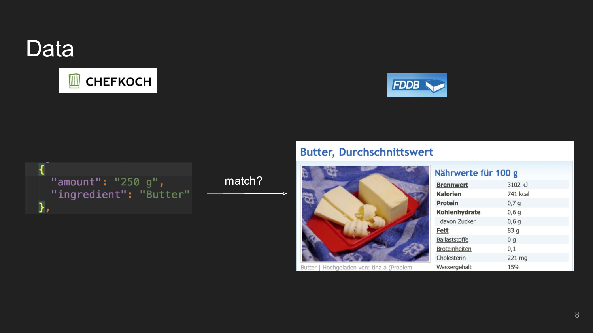

# Dataset

The final Pic2Cal dataset consists of the following files:

* `data/recipes/recipes_matched.jsonl` (1.94GB, 211k entries)

    All of the recipes with matched nutritional information per ingredient and in total

    Structure:

    ```json
 	[
	  {
	    "id": "[...]",
	    "title": "Die beste vegetarische Lasagne",
	    "subtitle": "",
	    "recipe_text": "Die geschälten Möhren und den geschälten Sellerie andünsten [...]",
	    "rating_count": 2,
	    "picture_urls": ["https://[...]", "https://[...]"],
	    "kcal_per_portion": null,
	    "restingtime_min": 1440,
	    "cookingtime_min": 30,
	    "workingtime_min": 40,
	    "rating": 3,
	    "author": "[...]",
	    "tags": [],
	    "canonical_url": "https://[...]",
	    "portions": 4,
	    "date": "[...]",
	    "difficulty": "normal",
	    "picture_files": ["./[...]", "./[...]"],
	    "nutritional_values": {
	      "per_portion": {
	        "Kohlenhydrate": {
	          "Menge": 68.064,
	          "Einheit": "g"
	        },
	        "Kalorien": {
	          "Menge": 671.8875,
	          "Einheit": "kcal"
	        },
	        "Protein": {
	          "Menge": 8.355,
	          "Einheit": "g"
	        },
	        "Fett": {
	          "Menge": 39.14,
	          "Einheit": "g"
	        },
	        "[...]": {}
	      },
	      "per_recipe": {
	        "[...]": {}
	      },
	      "per_100g": {
	        "[...]": {}
	      }
	    },
	    "ingredients": [
	      {
	        "original": {
	          "ingredient": "Möhre(n)",
	          "amount": "2"
	        },
	        "type": "ingredient",
	        "matched": {
	          "id": "[...]",
	          "name": "Karotten / Möhren, frisch",
	          "multiplier": 2,
	          "normal": {
	            "count": 200,
	            "unit": "g"
	          },
	          "weird": {
	            "count": 2,
	            "unit": "Stück"
	          },
	          "match_accuracy": 0.9999998807907104,
	          "matched": true,
	          "nutritional_values": {
	            "Kohlenhydrate": {
	              "Menge": 4.8,
	              "Einheit": "g"
	            },
	            "Wassergehalt": {
	              "Menge": 88,
	              "Einheit": "%"
	            },
	            "Kalorien": {
	              "Menge": 39,
	              "Einheit": "kcal"
	            },
	            "[...]": "..."
	          }
	        }
	      },
	      { "": "[...]" }
	    ]
	  }
	]
    ```

* `data/recipes/img/**/*.jpg` (181GB, 902k images)


# Pipeline

The total dataset is around 190GByte, most of which is the images.

1. Scraping
    1. Download fddb.info to html files using wget (sadly much more resource intensive than it should be since fddb.info immediately closes http connections after every call). `wget -4 -nc -r -l inf --adjust-extension --page-requisites --include-directories='/db/de/produktgruppen,/db/de/lebensmittel' https://fddb.info/db/de/produktgruppen/produkt_verzeichnis/index.html --reject jpg,png -o log4 --waitretry=3 -U 'Mozilla/5.0 (Windows NT 10.0; Win64; x64) AppleWebKit/537.36 (KHTML, like Gecko) Chrome/74.0.3729.169 Safari/537.36b`
    2. Run the steps in the [scraping](scraping/) directory one by one.
    3. `cd data/recipes && sqlite3 processed_data.sqlite3 'select data from recipes' |pv |jq -s > processed_data.json`

    This will give you these files:
    
    * `data/recipes/processed_data.json` containing all the recipes
    * `data/recipes/img/*` containing all the recipe pictures
    * `data/fddb_data.json` containing all the nutritional values

2. Ingredients Matching

    Run all the notebooks in the [extract_ingredients](extract_ingredients/) directory.

    You can run them in a docker container as follows:

        sudo docker run -p 8890:8888 -v /home/checkout/dir/pic2kcal:/tf/notebooks --runtime=nvidia -it --rm tensorflow/tensorflow:1.12.0-gpu-py3 jupyter notebook --allow-root --notebook-dir=/tf/notebooks


    This will give you these files:

    * `data/recipes/parsed_amounts.json` created by step 1 containing the unique amounts from the recipes parsed into (count, unit) tuples
    * `data/recipe-ingredient-to-fooddb.json` created by step 2 containing a mapping of all unique ingredient names from the recipes to a list of fooddb ingredients sorted by their matching accuracy
    * `data/recipes/recipes_matched.jsonl` created by step 3 that contains all recipes with the additional attribute `nutritional_values` for the whole recipe and with the matched ingredient for each original ingredient.
    * `data/recipes/ingredients_common.json` created by step 4 containing the most common ingredients used for the ingredients prediction in the network

3. Dataset creation

    Run [nn/data/do.sh](nn/data/do.sh) to create the three datasets (per 100g, per portion and per recipe). Image files will be created as symlinks to the results from the scraping scripts.

    **Input**: `data/recipes/recipes_matched.jsonl` and `data/recipes/ingredients_common.json` from above.

    **Output**: `nn/data/extracted_v3_per_{100g,recipe,portion}/{train,test,val}{/*.png,.json}`

3. Model Training

    Train a model using nn/train.py, for example:

        ./train.sh --runname dn121-p100g-nuting --datadir data/extracted_v3_per_100g --train-type kcal+nut+topings --bce-weight 400 --model densenet121 --test train+test

    Logs and the weights will be sade to `nn/runs`.

    bce weights:

    * per portion: bce-weight=800
    * per 100g: bce-weight=400
    * per recipe: bce-weight=2000

4. Model Evaluation

    For evaluation during training, run `nn/tensorboard.sh`

    To extract a Latex results table from the tensorboard logs, use `nn/table_from_tensorboard.py`

    To calculate the baseline (error when using the mean as the prediction) for a specific dataset, use `python baseline.py --datadir data/extracted_v3_per_portion`

# Paper

The paper is in [paper/paper.pdf](paper/paper.pdf).

# Result Slides





## Notes

### Potential recipe sites

* https://chefkoch.de - 320k recipes
* https://lecker.de - 8k recipes
* https://essen-und-trinken.de - ?? recipes, organized kinda weirdly
* https://lecker.de - 60k recipes
* https://www.kuechengoetter.de - ?? recipes, partially with kcal data
* https://eatsmarter.de/rezepte

* international sites?


## Potential nutritional database sites

* https://www.lebensmittelwissen.de/tipps/haushalt/portionsgroessen/
* https://www.bvl.bund.de/SharedDocs/Downloads/04_Pflanzenschutzmittel/rueckst_gew_obst_gem%C3%BCde_pdf.html?nn=1401078
* https://ndb.nal.usda.gov/ndb/
* https://fddb.info/
