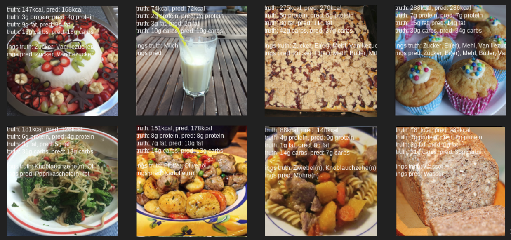

# Introduction

# Related Work

There's some other papers like [@chokr; @takumi; @salvador]. Ours is more end to end and also BETTER

# Dataset Extraction and Preprocessing

## Collection

We collected a dataset from the a popular German recipe website that contains ingredient lists, cooking instructions, and pictures of the resulting meals. The recipes are from many different cuisines and also include things like cakes, cocktails, and other. Most recipes have at least one picture. Pictures can come both from the original author of the recipe, as well as from third parties. Some of the pictures are of a single plate of food, others are for example of a whole casserole. We do not have any information about whether a picture contains a single portion. Around 10% of recipes contain a user-given value for how many calories per portion the recipe has.

## Matching / Preprocessing

Since the dataset only has user-given calorie information for a small part of the data and doesn't include any details regarding the macronutrient composition, and since the user given information is often inaccurate [todo: compare to ours??], we decided to match the list of ingredients against a database of nutritional values to sum up the proportions of macronutrients as well as the total calories.

To facilitate this, we collected a secondary dataset from a German website of nutritional values. The website contains values for the amount of fat, protein, and carbohydrates in grams per 100g of product. Additionally, it contains user-sourced food amounts like "1 medium-sized apple = 130g". The data is partially sourced from the USDA Food Composition Database [@usda], and partially crowd sourced from manufacturer-given data of specific products.

Matching the recipe ingredients to the nutritional database has two main problems.

Firstly, the given ingredient name often includes information that is not relevant to the product itself, but rather to its preparation or visual qualities. These additional text snippets are hard to separate from information that is relevant. For example: `3 onions, diced` and `3 onions, in slices` refer to the same product, while `500g pasta, cooked` and `500g pasta, raw` vary significantly in their caloric density. We experimented with three approaches [reformulate] to solve this problem. Firstly, we tried simply matching the ingredient to the nearest ingredient based on character edit distance (Levenshtein distance). This resulted in very bad matchings because of missing handling of synonyms and the above issue. To solve this we tokenize the ingredient name to words, embed each word to a vector with Word2Vec or FastText [@fasttext], and then use average the word vectors to get a ingredient vector. This is the same method as used in the fasttext library for extracting sentence vectors. This still lead to unsatisfactory results, since each word in the ingredient name has the same weight, even though some specify less important details. For example in "red onion" vs "red apple", the word "red" is much less important than "onion" and "apple". We got the best result by using the Google Universal Sentence Encoder [@googleuniv], which creates 512-dimensional embeddings of any amount of text. We find the best matches for a ingredient by comparing the embedding of user-given free text from the recipe to the embeddings for all food items for which we have nutritional data using the cosine distance, and then try to find a conversion for the given amount to a normalized gram or milliliter amount.

The second problem is matching the amounts. For ingredients given in grams this is trivial, but for many items the recipe authors use other units of measure like e.g. can, piece, tablespoon, "some", "2 large X", "salt 'by taste'". Since spices usually have little impact on the nutritional values, we exclude ingredients that are "by taste" and similar. For the other amounts, we match the unit name (like tablespoon or "medium large") exactly and multiply it with the given amount. We also add some special cases like matching "can" to "can (drained weight)" and similar.

The amount matching is applied to all possible ingredient matches that are similar by more than 84% (measured by cosine distance) [why lol] in decending order, or to the single closest ingredient if there is no match more accurate than 84%.

If the amount matching fails, the ingredient is marked as unmatched. If a recipe has at least one unmatched ingredient, it is discarded. With this method we have full nutritional information for around 38% of all recipes. This could be improved with further tweaking.

## Dataset Statistics

-   statistics about dataset
-   number of pictures per recipe
-   number of recipes
-   most common ingredients

# Models
We followed an end-to-end approach to solve the calorie prediction  problem of food images. To do so we used a pretrained ResNet and DenseNet architecture. We kept the feature extractor layers and replaced the last fully-connected classification layer. We try to solve the problem interpreting it on the one hand as a classification task and on the other hand as a regression problem. Furthermore we introduced additional learning feedback following a mutli-task approach.

We describe in the following only the last layer of the neural network.  

In the regression case we trained a model predicting only the kcal information with one output neuron and another to predict additionally protein, fat and carbohydrates information using 4 neurons. The two models were trained using a L1 and smooth L1 loss.

We transformed the two already described models to a classification problem quantising the regression outputs. So we introduced 50 class buckets for each regression output. The models were trained using a cross entropy loss.

The multi-task model is based on the regression model including the nutritional information with additional binary outputs to predict the top n ingredientssa

- (SmoothL1Loss + weight * BCE)
- What we predict (kcal, fat, etc, ings)

# Experiments

- todo: actually test 

\clearpage

# Results

Our results can be seen in [@tbl:res]. Example outputs can be seen in [@fig:results].

\begin{table}
\begin{center}
\begin{tabular}{|l|c|}
\hline
Method & kcal relative error \\
\hline\hline
baseline & 0.464 \\
ours (kcal only) & 0.361 \\
ours (w/ macros) & 0.352 \\
ours (w/ macros+ings) & 0.328 \\
\hline
\end{tabular}
\end{center}
\caption{Results per 100g. Note that multitask learning improves performance.\label{tbl:res}}
\end{table}

{#fig:results}

# References
