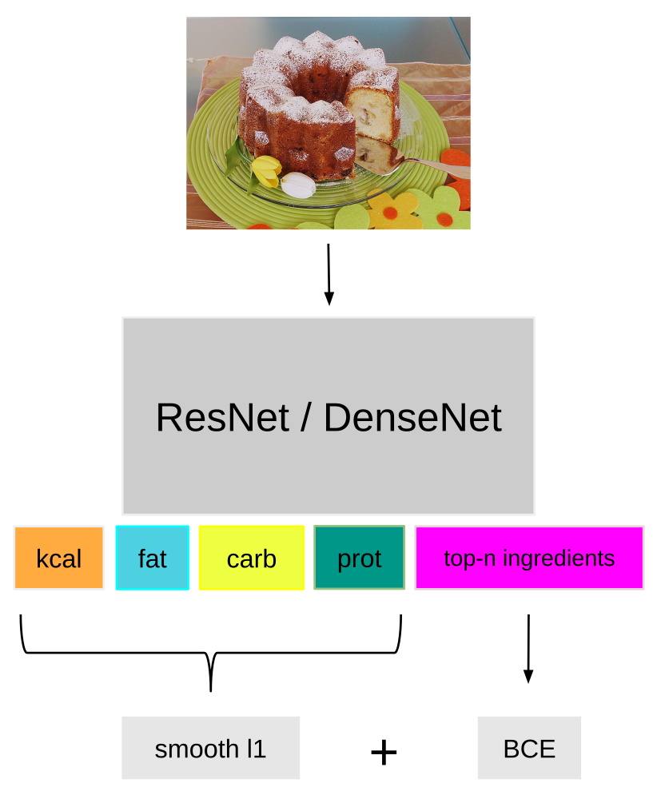

# Introduction

In recent years the awareness of healthier and more balanced diets has risen a lot. Tracking the exact amount and quality of food eaten is important for successfully following a diet, but doing this manually takes a lot of time and effort, leading to quick motivation loss and non-optimal results for many people.

Currently, calorie tracking is mostly done manually by looking up specific ingredients and amounts for each eaten meal. There are also a number of tools to help track calorie intake, such as the app Im2Calories by Google [@myers] from 2015, or CalorieMama [@caloriemama], with varying degrees of automation.

In this work we propose a method to predict the caloric content of any prepared food based only on a single picture of one portion in an end-to-end fashion.

We collected a dataset of recipes, pictures, and nutritional properties. Then we experimented with various features and models to best predict calories and other nutritional information directly from an image. We measure our results objectively against a baseline and show that multi-task learning improves the performance further.

# Related Work
Most of the previous approaches are based on several components to split the calorie prediction into sub problems. 

The authors in [@myers] implemented a mobile application and propose an approach which relies on several steps. In summary, they perform the following steps to estimate the calorie information: 

- Deciding if the image is a food image
- Restaurant detection according GPS 
- Food detection and image segmentation 
- Food size detection 

Since their approach uses a lot components it is not possible to train the system in a end-to-end fashion. 

The authors of [@takumi] trained a model using a multi-task CNN. They not only predict calories but also add an average ingredient word embedding, the type of food and an embedding of the preparation steps of the meal. They collected a dataset of English and Japanese recipes to train their models but it is not publicly available. 

<!-- 
There's some other papers like [@chokr; @takumi; ]. Ours is more end to end and also BETTER

-   [@chokr]:

    -   details von verena, wsl zu detailliert:
    -   supervised, pipeline: predict food-type -> predict size in g -> predict kcal based on size and food-type (nicht end-to-end)
    -   Dataset: Pittsburg fast-food image dataset (61Essens-Katergorien, 101Sub-Kategorien, jew. 3 Instanzen des Gerichts -> Annotiert mit Größe und Art des Gerichts; hier nur Subset verwendet (6 Klassen angerichten, ~1100 Bilder))
    -   Architektur / Ablauf

        -   PCA: auf 23Features runter
        -   Food-type-Classifier: verschiedene Varianten ausprobiert; beste: SVM
        -   Size Predictor: beste: Random forests
        -   Calories Predictor: NN als predictor
            -   input: 23 visual features + food type + food size
            -   Performance: Vergleich nur gegen eine eigene Studie, keine Angabe von Accuracy (Vergleich des pipeline-Ansatzes (visualfeatures+type+size) gegen Modell nur trainiert auf vis. features
        -   Handgemachte Annotationen für die Kcal-Angaben

-   [@myers]:

    -   wsl zu detailliert
    -   Restaurant specific im2calories
    -   Task1: Is food in Image ? -> Food vs. non-food (binäre Klassifikation)
        -   mit googLeNet CNN (pretrained on ImageNet)
    -   Task2: Content Analysis -> Calorie Prediction
        -   Training:
            1. vorhersage der Zutaten über multi-label classifier
            2. Lookup der Zutaten für mapping Zutat -> kcal
            3. dann schätzen der Gesamt-kcal-anzahl (Summe über die Zutaten-kcal)
        -   Test: auf Datensatz ‘MenuMatch’
    -   Mapping Zutat -> Kcal über FNDDS

-   calorie mama: recognizes ingredients and meals from pictures. pretty impressive tbh.
-   [@miyazaki]: "in which they searched the calorie-annotatedfood photo database for the top 5 similar images based onconventional hand-crafted features such as SURF-based BoFand color histograms and estimated food calories by averag-ing the food calories of the top 5 food photos"
-   [@salvador]: recipe generation (ingredients list, instructions, no amounts or kcal)
-   [@takumi]: multi-task VGG: kcal estimation, food categorization, ingredients estimation, cooking instructions. probably closest to ours? ingredients are not predicted individually, but as a single averaged word2vec embedding to make calorie prediction better
-   [@survey]: comparison of many different things: used datasets, segmentation methods, classification approaches, volume estimation methods of 10+ other papers

-->

# Dataset Extraction and Preprocessing

## Collection

We collected a dataset from a popular German recipe website that contains ingredient lists, cooking instructions, and pictures of the resulting meals. The recipes are from many different cuisines and also include things like cakes, cocktails, and others. Most recipes have at least one picture. Pictures are either uploaded by the original author of the recipe or by third parties. Some of the pictures are of a single plate of food, others are for example of a whole casserole. We do not have any information about whether a picture contains a single portion or more. Around 10% of recipes contain a user-given value for how many calories per portion the recipe supposedly has.

## Matching / Preprocessing

Since the dataset only has user-given calorie information for a small part of the data and doesn't include any details regarding the macronutrient composition, and since the user given information is often inaccurate (see [@fig:crappy]), we decided to match the list of ingredients against a database of nutritional values to sum up the proportions of macronutrients as well as the total calories.

{#fig:crappy}

To facilitate this, we collected a secondary dataset from a German website of nutritional values. The website contains values for the amount of fat, protein, and carbohydrates in grams per 100 grams of product. The data is partially sourced from the USDA Food Composition Database [@usda], and partially crowd sourced from manufacturer-given data of specific products. Additionally, it contains user-sourced food amounts like "1 medium-sized apple = 130g", which we use to convert human-intuitive amounts (like "1 piece" of fruit) that are commonly used in recipes to their equivalent mass.

Matching the recipe ingredients to the nutritional database has two main problems.

Firstly, the given ingredient name often includes information that is not relevant to the product itself, but rather to its preparation or visual qualities. These additional text snippets are hard to separate from information that is relevant. For example: `3 onions, diced` and `3 onions, in slices` refer to the same product, while `500g pasta, cooked` and `500g pasta, raw` vary significantly in their caloric density. This means that matching the ingredient text from a recipe to the ingredient from our nutritional database is non-trivial. We experimented with three approaches to solve this problem. Firstly, we tried simply matching each ingredient text to the nearest ingredient based on character edit distance (Levenshtein distance). This resulted in very bad matchings because of missing handling of synonyms and the above mentioned issue of irrelevant information in the ingredient text. To solve this we tokenized the ingredient name to words, embedded each word to a vector with Word2Vec or FastText [@fasttext], and then used the average of the word vectors to get an ingredient vector. This is the same method as used in the fasttext library for extracting sentence vectors. This still lead to unsatisfactory results, since each word in the ingredient name has the same weight, even though some words specify less important details. For example in `red onion` vs `red apple`, the word `red` is much less important than `onion` and `apple`. Finally, we got the best result by using the Google Universal Sentence Encoder [@googleuniv], which creates 512-dimensional embeddings of any amount of text. We find the best matches for an ingredient by comparing the embedding of the user-given free text from the recipe to the embeddings for all food items for which we have nutritional data using the cosine distance ^[equivalent to the dot product, since the embedded vectors are all normalized], and then try to find a conversion for the given amount to a normalized gram or milliliter amount.

The second problem is matching the amounts. For ingredients given in grams this is trivial, but for many items the recipe authors use other units of measure like e.g. can, piece, tablespoon, "some", "2 large X", "salt 'by taste'". Since spices usually have little impact on the nutritional values, we exclude ingredients that are given "by taste" and similar. For the other amounts, we match the unit name (like tablespoon or "medium large") exactly and multiply it with the given amount. We also add some special cases like matching "can" to "can (drained weight)" and similar.

The amount matching is applied to all possible ingredient matches that are similar by more than 84% (measured by cosine distance) in decending order until a matching amount is found, or to the single closest ingredient if there is no match more accurate than 84%.

If the amount matching fails, the ingredient is marked as unmatched. If a recipe has at least one unmatched ingredient, it is discarded. We immediately discard recipes without perfect matches so we can be sure our dataset is accurate at the cost of losing a lot of mostly good samples.

As a final step, we filter out all data points where the summed up calories of the recipe is outside of two standard deviations from the mean repeatedly until the outlier removal converges. This is necessary because some recipes contain obviously wrong information (for example in one carrot cake recipe the author specified to use a million carrots for fun, ignoring the plight of the poor data scientists trying to make that data useful).

## Dataset Statistics {#sec:stats}

In total, the recipe website contains 330 thousand recipes. Of these, 210 thousand have at least one picture. Around 20 thousand recipes with pictures have user-given calorie information, though we didn't use these in the end. The recipes contain a total of 374 thousand unique ingredients. This high number is caused by slight differences in spelling or irrelevant details. In total, we collected 900 thousand pictures. On average, each recipe has 3 pictures.

The database of nutritional values contains a total of 390 thousand ingredients. Many of these are incomplete or duplicates, so we filter them by popularity to 123 thousand ingredients.

After matching the ingredients to the recipes, we have 50 to 85 thousand recipes with full nutritional information, depending on whether we aggregate calories per recipe, per portion or per 100g of raw mass (see [@sec:experiments]). We lose 60% of recipes during matching because our matching discards recipes quickly when the ingredients don't fully match. This is so we can ensure we only retain data points that are accurate, and it could be improved with further tweaking. When aggregating per portion, we lose even more data points since we have to exclude all recipes where the user did not supply information about how many portions a recipe consists of (which is equivalent to setting it to one portion per recipe). More details are in [@tbl:stats].

In total, we have around 179 to 308 thousand data points (because each recipe has multiple images). We split these into train, validation and test set such that multiple pictures of the same recipe are in the same data split.

<!-- todo: convert table to latex probably so it is consistent  

|                            | per portion | per 100 g | per recipe |
| -------------------------- | ----------- | --------- | ---------- |
| recipes count before       | 211k        | 211k      | 211k       |
| removed no ings match      | 127k        | 127k      | 127k       |
| removed no portions        | 31k         | 0k        | 0k         |
| kcal mean                  | 425 kcal    | 179 kcal  | 1791 kcal  |
| kcal stddev                | 207 kcal    | 73 kcal   | 1007 kcal  |
| kcal outliers              | 11k         | 14k       | 21k        |
| final recipe count         | 42k         | 70k       | 63k        |
| **final data point count** | 179k        | 308k      | 267k       |
-->

\begin{table}
\begin{center}
\begin{tabular}{llll}
\toprule
                           & per portion & per 100 g & per recipe \\
\midrule
recipes count before       & 211k        & 211k      & 211k       \\
removed no ings match      & 127k        & 127k      & 127k       \\
removed no portions        & 31k         & 0k        & 0k         \\
kcal mean                  & 425 kcal    & 179 kcal  & 1791 kcal  \\
kcal stddev                & 207 kcal    & 73 kcal   & 1007 kcal  \\
kcal outliers              & 11k         & 14k       & 21k        \\
final recipe count         & 42k         & 70k       & 63k        \\
\textbf{final data point count} & 179k        & 308k      & 267k  \\
\bottomrule
\end{tabular}
\end{center}

\caption{Statistics of our dataset depending on what amount of food the calories are predicted for.\label{tbl:stats}}
\end{table}

The 20 most common ingredients are shown in [@tbl:ings]. Note how common baking ingredients are. This indicates a cake bias, i.e. the dataset may be biased towards sweet meals and desserts.

\begin{table}
\begin{center}
\begin{tabular}{|r|l|}
\hline
Count & Ingredient \\
\hline\hline
119244 & Salz \\
59066 & Zucker \\
58185 & Ei, vom Huhn \\
46069 & Mehl \\
45891 & Butter \\
41206 & Zwiebel, frisch \\
24531 & Milch (3,8 \%) \\
24011 & Vanillezucker \\
23476 & Zucker \\
22822 & Öl \\
22781 & Paprika, orange \\
21348 & Knoblauch \\
20359 & Wasser \\
19935 & Knoblauch, frisch \\
19336 & Pfefferbreze \\
18928 & Olivenöl \\
15966 & Backpulver \\
15039 & Sahne \\
14751 & Zitrone, frisch \\
13077 & Paprikapulver \\
12487 & Gemüsebrühe, pflanzlich \\
12136 & Backpulver \\
11960 & Käse \\
11673 & Kartoffeln \\
10926 & Eigelb, vom Huhn \\
10780 & Butter, Durchschnittswert \\
9591 & Puderzucker \\
9439 & Petersilie, frisch \\
8708 & Zucchini, grün, frisch \\
8293 & Mehl, Weizenmehl Typ 405 \\
\hline
\end{tabular}
\end{center}
\caption{Most common ingredients after matching.\label{tbl:ings}}
\end{table}

# Models {#sec:models}

We followed an end-to-end approach to solve the calorie prediction problem for food images. To do so we used pretrained ResNet [@ResNet] and DenseNet [@DenseNet] architectures as base models. We kept the feature extractor layers and replaced the last fully-connected classification layer. We tried solve the problem interpreting it on the one hand as a classification task and on the other hand as a regression problem. Furthermore we introduced additional learning feedback following a multi-task learning approach.

In the following, only the last layer of the neural network is described. 
In the regression case we trained a model to predict the calorie information with one output neuron and additionally to predict protein, fat and carbohydrate information using three additional neurons. The two models were trained using the smooth L1 loss.

For the classification approach, we adapted the base architectures to the classification problem by quantizing the regression outputs. So we introduced 50 class buckets for each regression output. The models were then trained using the cross entropy loss.

The multi-task model is based on the regression model including the nutritional information with additional binary outputs to predict the top $n=100$ ingredients. The resulting layer has four regression outputs for the calories and macronutrients with n binary outputs for the top n ingredients, as can be seen in [@fig:model]. The used loss combines the smooth L1 loss for the regression outputs and a binary cross entropy loss for the top ingredients. To get the same scaling of the two learning signals we scaled the binary cross entropy loss with a factor $\gamma$ depending on the used dataset, so the two losses are balanced. $$ \text{loss} = \text{L1} + \gamma \cdot \text{BCE} $$

{#fig:model width=30%}

As there are no reference papers working with similar approaches or similar data, the results could not directly be compared to other studies.
Hence, a simple baseline was implemented to get evidence that our models actually learn and that they are better than random guessing. 

The baseline model for the calorie prediction always predicts the mean of all samples in the training dataset. The same mean baseline was used for predicting the macronutrient data. 

# Experiments {#sec:experiments}

We divided the generated dataset into train/test/validation (.7/.15/.15) splits. The network was trained for 25 epochs using a batch size of 50 samples each batch. The samples were shuffled every epoch and we evaluated the performance of the model every 200th batch. We implemented all networks using PyTorch [@pytorch].

To evaluate the performance of the model we trained several networks and ran several experiments and evaluated them using the validation data set to get quick feedback. To measure the performance of the model we primarily compared the ground truth calorie information with the prediction of the network.

Initially we wanted to predict the calories of a meal shown on an image. Since the dataset we have collected does not provide information for this task we run the following experiments:

- calorie prediction per recipe 
- calorie prediction per portion 
- calorie prediction per 100g of raw ingredient mass

We did the first experiments on the raw and unfiltered dataset. In between we evaluated  a classification model because of the bad performance of the regression model. The actual problem was not the model itsel but more with the outliers which were in the dataset. For the further experiments we used only the regression models. 

Firstly we comment on the problem space of the per recipe, per portion and per 100g prediction type.
We wanted the network to predict the calories of the recipe shown in the given input image. To perform well on this task the model needs to learn the concept of the recipe size and predict the calories according it. We assumed that the problem would be well learnable due to the amount of samples and the capacity of the model. Unfortunately, the trained regression model did not perform well on the task. When predicting normalized calories per portion the model was only slightly better than the baseline model. We reformulated the training objective to a slightly easier problem: Predicting the caloric density of the visualized image. Because of the normalization the network only needs to grasp how many calories are in for instance 100g of the meal. This modification led to significantly better results.

Furthermore we ran experiments to answer the question if further information improves the prediction of the network. We ran experiments with the following three levels of additional information:

- **kcal only:** As reference we predicted the calories directly with no further information. 
- **kcal +  nutritional information:** The additional macronutrient information improved the generalization of the network.
- **kcal +  nutritional information + top 100 ingedients:** We managed to furthermore improve the results of the model using the multi-task approach. The top 100 ingredients of the recipes were injected as further information to support the model in predicting the calories. 

We report the results of most of these experiments in the result section.

# Results

For an objective comparison, we focus on the relative error ($\text{rel\_error} = 1 - \frac{\text{pred}}{\text{truth}}$) of the kcal output. We also provide the absolute error (L1 error) of calories (in kcal), fat, protein, and carbohydrates (each in grams). The relative error is meaningless here, since in many dishes at least one of the macronutrients is not present at all. In all the [@tbl:resbymodel; @tbl:resperper; @tbl:resbytask], the first column is relative, the others are the absolute error (in kcal or grams). 
We computed a baseline as described in [@sec:models], then we compared the results for three different questions. Unless noted otherwise, the model is a DenseNet121, predicting calories, macros and ingredients per 100g. 

We first compared different model architectures, as seen in [@tbl:resbymodel]. The DenseNet architecture provided the best results. ResNet and ResNeXt [@resnext] both had worse results.

We then compared predicting the calories for different amounts of food ([@tbl:resperper]), since we do not have an estimation of the actual amount of food in each picture. The most useful prediction, which is the amount of calories per portion, did not yield satisfactory results. This can be mostly attributed to the fact that we had less data for these predictions (see [@sec:stats]), and that the number of portions in one recipe is very subjective. Predicting the amounts per 100g of raw mass works best.

Lastly, we compared the effect of predicting the macronutrient amounts (fat, carbohydrates, protein) and of the ingredients in addition to the calorie amount ([@tbl:resbytask]). It can be seen that using multi-task learning improves the performance of our model. This shows that the model is able to learn the correlation between the amount of different macronutrients and the amount of calories, as well as between the ingredients and the calories, even though how these are correlated (e.g. 1g of protein = 4kcal) is never explicitly given.

A set of example outputs from our best model can be seen in [@fig:results].

<!--
\begin{table}
\begin{center}
\begin{tabular}{|l|c|}
\hline
Method & kcal relative error \\
\hline\hline
baseline & 0.464 \\
ours (kcal only) & 0.361 \\
ours (w/ macros) & 0.352 \\
ours (w/ macros+ings) & 0.328 \\
\hline
\end{tabular}
\end{center}
\caption{Results per 100g. Note that multitask learning improves performance.\label{tbl:res}}
\end{table}
-->

\begin{table}
\begin{center}

\begin{tabular}{lrrrrr}
\toprule
{} &  kcal (rel) &  kcal &  protein &  fat &  carbs \\
\midrule
baseline & 0.464 & 60.5 & 3.10 & 4.49 & 10.5 \\
resnet50        &               0.334 &         47.8 &            2.54 &        3.93 &                  7.13 \\
resnet101       &               0.336 &         48.2 &            2.54 &        3.94 &                  7.17 \\
resnext50\_32x4d &                0.33 &         47.2 &             2.50 &        3.89 &                  6.99 \\
\textbf{densenet121}      &               \textbf{0.326} &         46.9 &            2.51 &        3.88 &                  6.97 \\
densenet201     &               0.327 &         47.2 &            2.53 &        3.89 &                  7.04 \\
\bottomrule
\end{tabular}
\end{center}

\caption{Results by model architecture. DenseNet performs best. \label{tbl:resbymodel}}
\end{table}

\begin{table}
\begin{center}

\begin{tabular}{lrrrrr}
\toprule
{} &  kcal (rel) &  kcal &  protein &  fat &  carbs \\
\midrule
per portion \\
baseline & 0.787 & 173 & 11.4 & 11.8 & 21.6 \\
ours  &               0.632 &          154 &            9.21 &        10.8 &                  19.1 \\
\midrule
per recipe \\
baseline & 1.23 & 858 & 41.9 & 54.4 & 125 \\
ours   &    0.823 &          711 &            34.8 &        46.9 &                  94.4 \\
\midrule
per 100g \\
baseline & 0.464 & 60.5 & 3.1 & 4.5 & 10.5 \\
ours     &               0.326 &         46.9 &            2.51 &        3.88 &                  6.97 \\
\bottomrule
\end{tabular}
\end{center}

\caption{Results depending on what amount of food the nutritional values were predicted for. \label{tbl:resperper}}
\end{table}

\begin{table}
\begin{center}

\begin{tabular}{lrrrrr}
\toprule
{} &  kcal (rel) &  kcal &  protein &  fat &  carbs \\
\midrule
kcal only      &               0.362 &         50.3 &             nan &         nan &                   nan \\
\"+ macros        &               0.345 &           49.0 &            2.67 &        4.06 &                   7.7 \\
\textbf{\"+\"+ top100ings}     &               \textbf{0.326} &         46.9 &            2.51 &        3.88 &                  6.97 \\
\bottomrule
\end{tabular}
\end{center}

\caption{Results by task.\label{tbl:resbytask}}
\end{table}

{#fig:mtl}

{#fig:results width=40%}

# Problems / Fails

Following we describe the most time consuming difficutlties we faced while working on the practical course task. 

- **Scraping:** It was fairly straight forward to crawl the recipes internet page because of the graceful HTML structure, though it still took time due to the huge amount of data. It  was more challenging to extract the data from the nutritional database website. The main problem was to find a proper method to extract the needed information out of multiple HTML tables which were modeled using a ton of div tags in a hard parse manner.  

- **Ingredient matching:** The matching of the recipe ingredients and the food database ingredients could not be solved with a simple method like Levenshtein distance. The obvious pairs could be matched but once for instance further information like *peeled potato*  was provided often the optimal match was not found. There was a lot of experimentation and some hacks involved to get it working well.

- **Kcal outlier:** It was not possible to use the raw user given kcal details because some of them were not accurate. The loss of the trained regression models exploded with bad results as consequence. Based on the matching we calculated our own calorie information and filtered the outlier recipes.

- **Tensorboard image visualization:** We used TensorBoard to be able to debug the models. We logged meta data including the images of the recipes. Because of an error related to the image normalization the images got destroyed. 
 

# Future Work

We currently only use a portion of the information in our extracted dataset. There are other interesting attributes such as the type of the meal (cake, side dish), the ingredient amounts, the cooking instructions, the rating, and further properties. These could be used to further improve our calorie prediction model as did adding prediction of the ingredients. The current dataset contains all available photos of each recipe. It may make sense to implement sanity checks to filter images out if they do not match the recipe in a proper way.

Our best results were when only predicting the caloric density of foods. To better solve our original task of predicting the total amount of calories in one picture, we would need to filter the dataset to only include pictures of a single portion of food. In addition, we have not fully solved the problem of portion sizes being very subjective and thus varying a lot between recipes and even pictures of the same recipe.

The cooking instructions could also be used to improve the ingredient matching by fine-tuning the text embedding model. We only used the pretrained Universal Sentence Encoder which is trained on online sources like Wikipedia, news, and discussion forums. Since these sources are very generic all ingredients are probably very close in the embedding space even though they may be different. The user-given free text formulation of the cooking instructions usually contain the names of the ingredients in text. Fine-tuning the Sentence Encoder with those instructions should help better encode similar ingredients (e.g. you usually add either baking powder or yeast at a specific cooking stage, so they are fairly similar ingredients).

Further problems related to food could also be approached using the dataset. For some people it may be interesting to know if a meal contains a specific ingredient because of allergies, if it is vegan or vegetarian, or if it fits a specific diet. The dataset provides needed information to train a variety of different models to solve problems related to food.

Currently our calorie prediction model is not highly optimized for the task since it is built on top of pretrained models. As we have shown it is beneficial to inject other data into the model therefore it may be interesting to do further investigation on different model architectures. For instance the representation of the top-n ingredient neurons could be changed from a binary value to a regression predicting the amount of the ingredient. It may also make sense to build entire new architectures using kernels with a size which match the requirements of predicting/classifying food images.

# References
